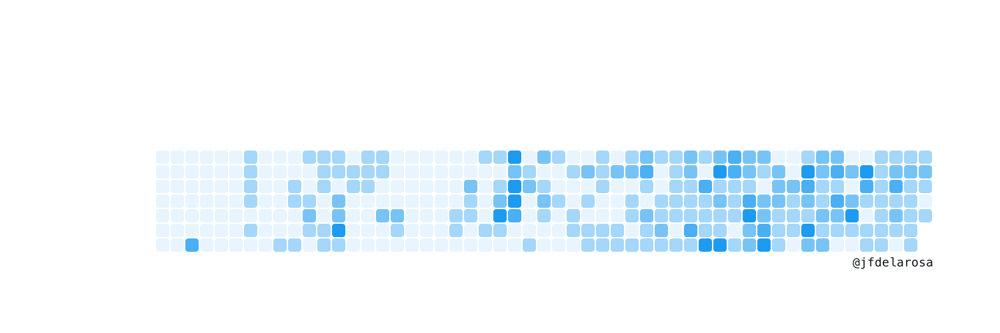

# Octobird

Octobird is an web app that changes your Twitter banner based on your GitHub contributions.

Generated banner:


## Pre requisites

Rename `.env.production` to `.env` and set the variables

### Install dependencies

```bash
npm install
```

## Developing

Once you've created a project and installed dependencies with `npm install` (or `pnpm install` or `yarn`), start a development server:

```bash
npm run dev
```
